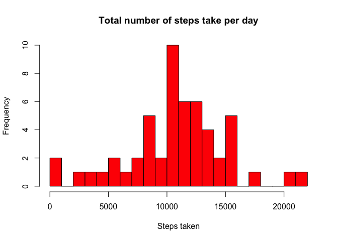
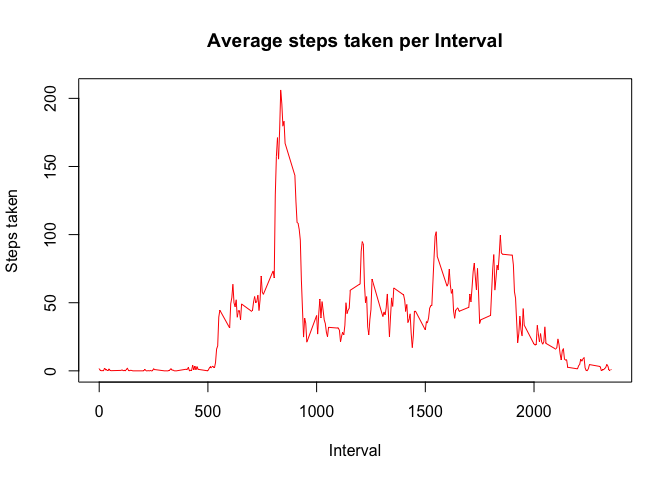

# Reproducible Research: Peer Assessment 1


## Loading and preprocessing the data

First, let's read the CSV file into memory, assuming the activity.csv file is in your current working directory


```r
df <- read.csv("activity.csv", header=T, sep=",")
```

and take a look at it, including performing some basic checks: number of rows, variables and complete rows:


```r
head(df)
```

```
##   steps       date interval
## 1    NA 2012-10-01        0
## 2    NA 2012-10-01        5
## 3    NA 2012-10-01       10
## 4    NA 2012-10-01       15
## 5    NA 2012-10-01       20
## 6    NA 2012-10-01       25
```

```r
str(df)
```

```
## 'data.frame':	17568 obs. of  3 variables:
##  $ steps   : int  NA NA NA NA NA NA NA NA NA NA ...
##  $ date    : Factor w/ 61 levels "2012-10-01","2012-10-02",..: 1 1 1 1 1 1 1 1 1 1 ...
##  $ interval: int  0 5 10 15 20 25 30 35 40 45 ...
```

```r
nrows <- nrow(df)
ncols <- ncol(df)
```

The number of rows in the activity data set is 17568 over 3 variables. 

We convert the date from level to character.


```r
df$date <- as.character(df$date)
```

Usually, the check and management of missing values would happen at the start of the file. However, since it is an explicit task in the assignment description at a later stage, this preparatory step is postponed (see below).


## What is mean total number of steps taken per day?

First, aggregate the steps taken by day and calculate its mean and median


```r
df.stepsDay <- aggregate(df$steps, by=list(df$date), FUN=sum, na.rm=F)
df.stepsDayMean <- mean(df.stepsDay$x, na.rm=T)
df.stepsDayMedian <- median(df.stepsDay$x, na.rm=T)
```

The mean of steps taken per day is 10766. The median of steps taken per day is 10765. 

Now we can also draw the total step count for each day as historgram: 


```r
hist(df.stepsDay$x, 
     breaks=20,
     main="Total number of steps take per day", 
     col="red", 
     xlab="Steps taken")
```

 


## What is the average daily activity pattern?

1. Make a time series plot (i.e. type = "l") of the 5-minute interval (x-axis)
and the average number of steps taken, averaged across all days (y-axis). In other words: what is the average number of steps taken for each intervall across all days (note that intervall IDs repeat every 24h). 


```r
df.stepsInterval <- aggregate(df$steps, by=list(df$interval), FUN=mean, na.rm=T)

plot( x=df.stepsInterval[,1], 
      y=df.stepsInterval[,2], 
      type="l",
      col="red",
      main="Average steps taken per Interval",
      ylab="Steps taken", 
      xlab="Interval")
```

 


2. Which 5-minute interval, on average across all the days in the dataset,
contains the maximum number of steps?


```r
maxinterval <- df.stepsInterval[which.max(df.stepsInterval[,2]),1]
```

The interval with the maxium number of steps across all days is 835.


## Imputing missing values


```r
nas   <- sum(is.na(df))
compl <- sum(complete.cases(df))
```

Overall there are  2304 incomplete rows containing NAs, leaving 15264 complete rows. For filling in the missing values, we match Intervall IDs and use the mean steps across all days for a given interval to populate the NAs in the newly created clean dataframe: 


```r
df.clean <- cbind(df, df.stepsInterval[,2])
names(df.clean)[4] <- c("mean")

df.clean$steps <- ifelse( is.na(df.clean$steps), df.clean$mean, df.clean$steps)
```

On the new dataset, calculate again mean and median of total number of steps taken each day:

```r
df.clean.stepsDay <- aggregate(df.clean$steps, by=list(df.clean$date), FUN=sum)
df.clean.stepsDayMean <- mean(df.clean.stepsDay$x)
df.clean.stepsDayMedian <- median(df.clean.stepsDay$x,)
```

The mean of steps taken per day for the cleaned dataset is 1.0766189\times 10^{4}. The median of steps taken per day is 1.0766189\times 10^{4}.  

Now we can also draw the total step count for each day as historgram: 


```r
hist(df.clean.stepsDay$x, 
     breaks=20,
     main="Total number of steps take per day", 
     col="red", 
     xlab="Steps taken")
```

 

There are no big differences between the mean and median of the two datasets. First, because the calculation of the mean/media values of the original dataframe can only be calculated by removing the NA values first. Second, because the missing values filled in are based on the mean values of the interval, i.e. new newly calculated mean basically is drawn closer to the mean values of the first dataset anyway. There is no big difference between mean/media steps between the two dataframes.  


## Are there differences in activity patterns between weekdays and weekends?

Let's add first an extra column to the dataframe indicating if the given date is a weekday or not and then create two subsets, one containing the data for weekends and the other for weekdays. We also need to convert the date from class character to class Date in order for the weekday/end function to do its job. 


```r
df.clean$date <- strptime(df.clean$date, "%Y-%m-%d")
df.clean$weekend <- (weekdays(df.clean$date) %in% c("Sunday", "Saturday"))

df.weekend <- df.clean[df.clean$weekend == TRUE,]
df.weekday <- df.clean[df.clean$weekend == FALSE,]
```

Finally, calculate the average of steps for each interval for the two subsets and draw the graphics. 


```r
df.weekend.steps <- aggregate(df.weekend$steps, by=list(df.weekend$interval), FUN=mean)
df.weekday.steps <- aggregate(df.weekday$steps, by=list(df.weekday$interval), FUN=mean)

par(mfrow=c(2,1))

plot( x=df.weekend.steps[,1], 
      y=df.weekend.steps[,2], 
      type="l",
      col=124,
      main="Weekend average steps per interval",
      ylab="Average steps", 
      xlab="Interval ID")

plot( x=df.weekday.steps[,1], 
      y=df.weekday.steps[,2], 
      type="l",
      col=554,
      main="Weekday average steps per interval",
      ylab="Average steps", 
      xlab="Interval ID")
```

 

As the graphics show, the pattern of steps taken is different: whereas the mean of weekend steps are more equally distributed across all intervals, the weekdays have a realively early peak (sports?) and then become lower for the rest of the day. The relatively lower rates during a large part of the weekday could be interpreted as reflecting sitting at work or school. 


